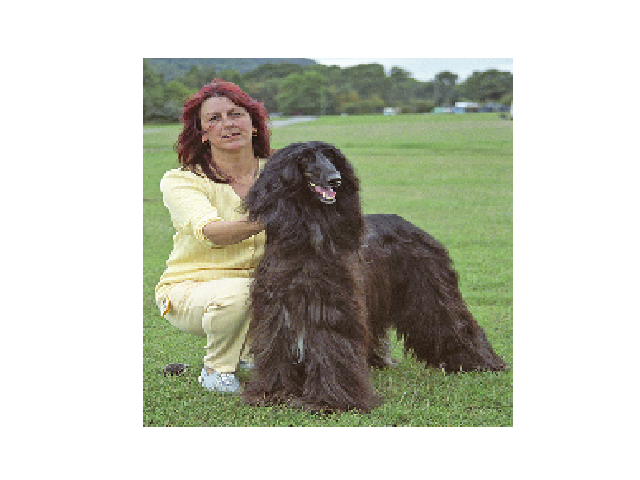
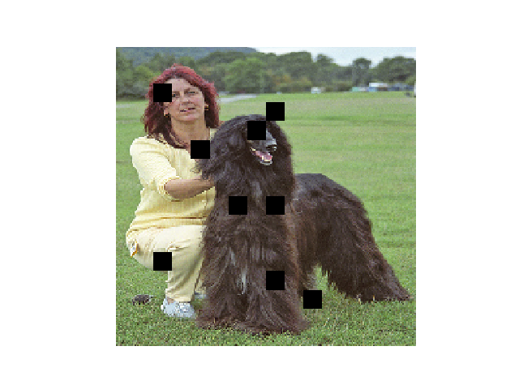
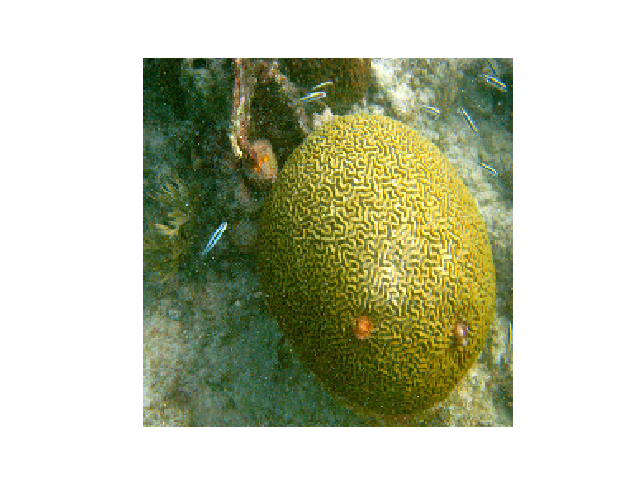
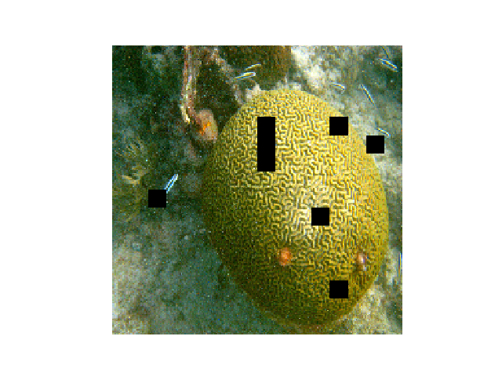

# Evolutionary Adversarial Attack

A simple project for **Adversarial Attack** using Evolutionary Algorithm.

## 1. Adversarial Attack

Adversarial example/image is a modified version of a clean image that is intentionally perturbed (e.g. by adding noise) to confuse/fool a machine learning technique, such as deep neural networks.

In this project, we achieve the adversarial attack in a simple way by pasting some black patches on the original images.

First, we can split the image into some squares for simplicity. Take ImageNet as an example, the original test image is resized to 224x224. Thus, it can be split into 16x16 squares, each square contains 14x14 pixels. That is to say, we need to find out which of these squares should be blackened to fool the neural network.

Because it is impossible to use brute-force search to solve this, we use evolutionary algorithm to address this. As defined above, we can use a vector S of 0, 1 to represent the state of each square, where 0 denotes the square is blackened. Thus the objective function is formulated as follow:

```
F = sum(S) + (1 - logits(original_class))
```

The first term is using to minimize the amount of blackened squares, while the second term is using to distinguish the quality of two solution with same amount of blackened squares.

Then we can use EA to search for the proper adversarial attack solution.

## 2. Evolutionary Process

The evolutionary search process is shown as follow. We use a general framework of GA with uniform crossover and mutation.

```
Init population
Evaluate population
while (gen < max_gen):
    Select best 5 individuals as parent
    Generate new individuals via crossover and mutation
return the top 1 individual
```

In this project, we set the population size to 30, and evolute for 50 generations.

## 3. Some Examples

We take two images from the validation set of ImageNet as examples, and use the ResNet-50 as the victim.

The first image's label is Afghan_hound(160). The original logit is 0.998769. (The image is resized to 224x224)

<div style='text-align:center'>

</div>

So, what about the result after attack?

After blackened 9 squares, the output label changes to 568(Fur_coat) with a logit of 0.254522. Maybe we can conjecture something from the blackened image. The dog's face is discarded, and the human and the fur are detected by the network, thus it results as the Fur_coat.

<div style='text-align:center'>

</div>

The second image is from the class of brain coral, a kind of coral which looks like human brain. The original logit is 0.986947.

<div style='text-align:center'>

</div>

After attack, the output label changes to 973(coral_reef) with a logit of 0.218608.

<div style='text-align:center'>

</div>

## 4. Future Work

1. Search efficiency
    * Current GA totally needs to inference the network about 1,500 times, which can be further accelerated.
2. Square size
    * We currently only attack the image at square-level, how about the pixel-level?
3. Color attack
    * In this project, we only attack the network by blacken the squares. However, it can be done in a more flexible way by editting the RGB value of pixel rather than simply blackening them.